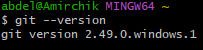
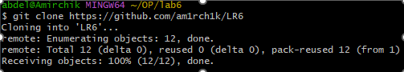

# Лабораторная работа №6

---

## Система контроля версий GIT

---

## Цель: изучение базовых возможностей системы управления версиями, опыт работы с Git Api, опыт работы с локальным и удаленным репозиторием.

---

## Ход работы

### 1. Создал аккаунт на сайте GitHub и сделал копию в личное хранилище.

### 2. Установил Git

### 4. Настроил клиент git, введя имя пользователя и email

### 5. Клонировал свой личный удалённый репозиторий на компьютер

### 6. Добавил файл через интерфейс GitHub. Подтянул изменения в локальный репозиторий

### 7. Получил историю операций для каждой из веток

### 8. Просмотрел последние изменения

### 9. Выполнил слияние в ветку master, разрешив конфликт.

### (В файле mergefile появились маркеры конфликта, указывающие на две возможные версии файла. Была выбрана одна из предлагаемых версий, а впоследствии она же была несколько перезаписана для наглядности успеха)

### 10. Коммит, утвердивишй успешное слияние

### 11. Удалил побочную ветку после успешного слияния

### 12. Сделал изменения и зафиксировал их, оставляя комментарии несколько раз

### 13. Сделал откат коммита

### 14. Создал ветку для отчёта

### 15. Получил историю операций в форматированном виде

---

## Вывод

### Изучил базовые возможности системы управления версиями. Получил опыт работы с Git Api, опыт работы с локальным и удаленным репозиторием.
